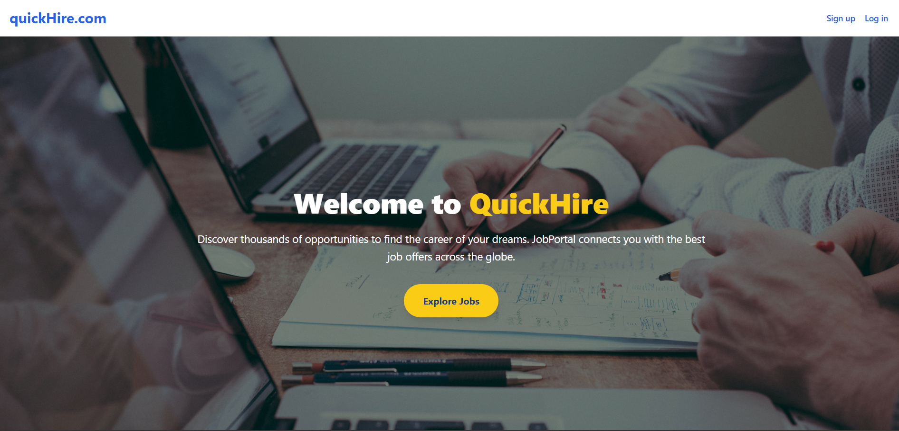
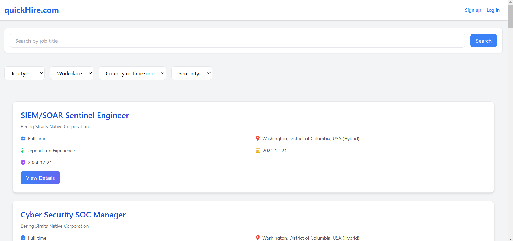
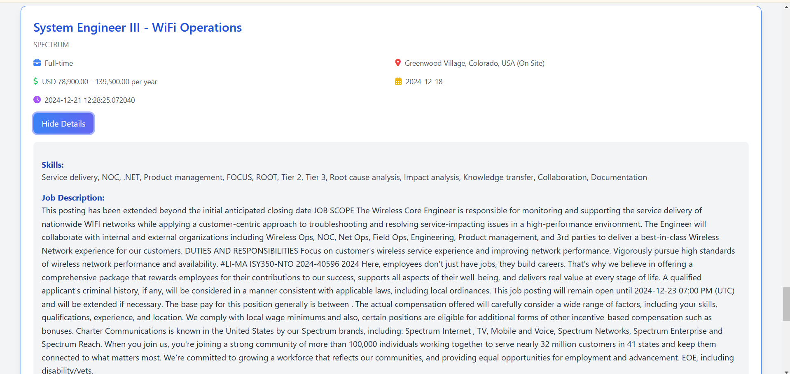
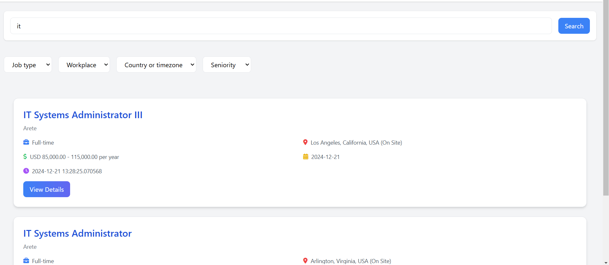
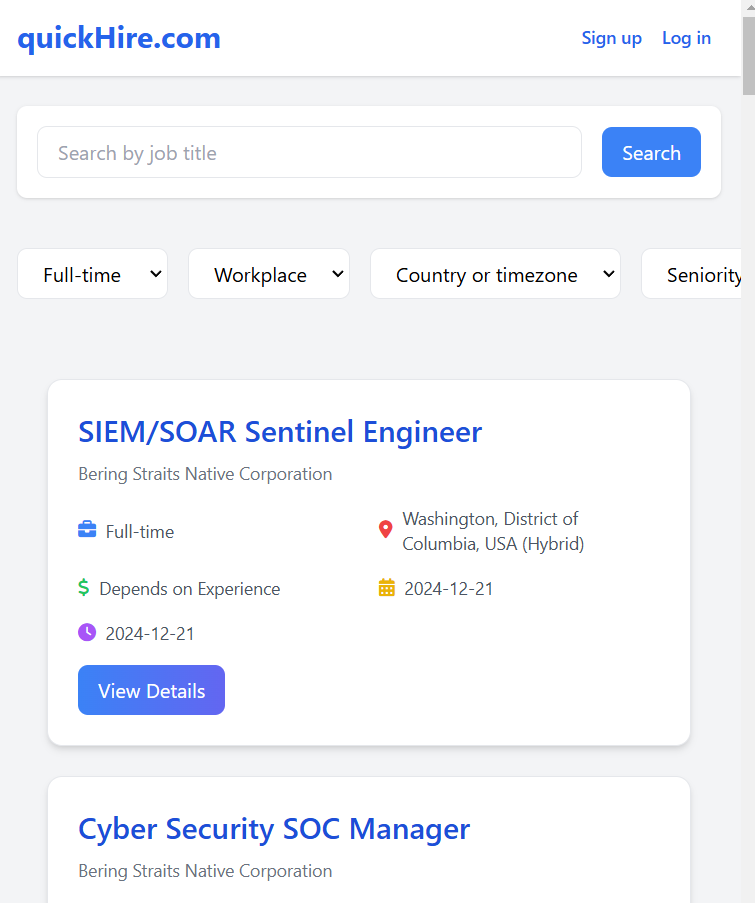

# Quick Hire

Quick Hire is a full-stack web application designed to simplify job listing management and display. The project integrates a robust backend, efficient scraping capabilities, and a sleek frontend to deliver an intuitive user experience.

- **Backend**: Powered by Django REST Framework for API development.
- **Scraper**: Developed using Scrapy, Selenium to collect job data from external sources.
- **Frontend**: Built with ReactJS and styled using Tailwind CSS for a modern and responsive user interface.

---

## Features

### Backend
- **GET API**: Retrieves job data from the MySQL database.
- **POST API**: Inserts new job data into the database via a POST request.

### Scraper
- **Scrapy and Selenium Framework**: Scrapes job data from external APIs or web pages.
- **Pagination Handling**: Effectively handles pagination to collect comprehensive job listings.
- **POST Request**: Automatically sends scraped data to the backend API for storage.

### Frontend
- **User Interface**: Displays job listings in a structured and user-friendly format.
- **Responsive Design**: Optimized for various devices using Tailwind CSS.

---

## Technologies Used

- **Backend**: Django REST Framework, MySQL
- **Scraper**:Scrapy, Selenium (Python)
- **Frontend**: ReactJS, Tailwind CSS

---

## Screenshots

### UI Screenshots
1. **Home Page**:
   
2. **Job Listings**:
   
3. **View Job details**:
   
4. **Searching**:
   
5. **Responsive design**:
   

---

Thank you for exploring Quick Hire!
